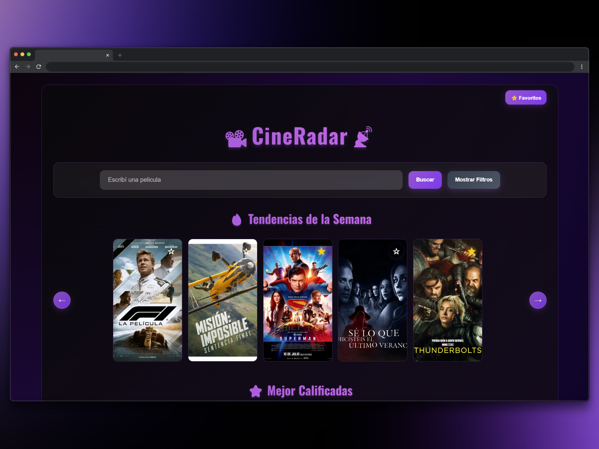
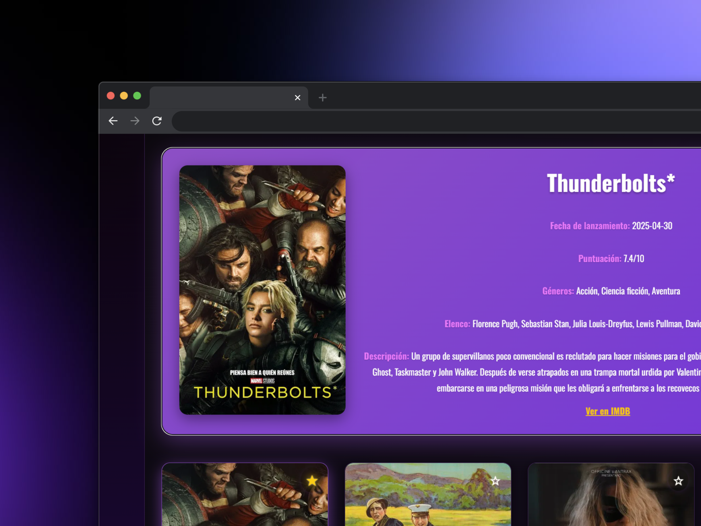

# 🎬 CineRadar

¡Bienvenido a **CineRadar**! Un buscador de películas moderno, rápido y responsivo para descubrir tendencias, estrenos, populares y buscar por nombre, género, año, calificación y más. Incluye trailers, elenco, géneros, enlaces directos a IMDB y gestión de favoritos persistente.

## 🚀 Tecnologías utilizadas
- **React 18**
- **Vite**
- **CSS moderno y responsive**
- **The Movie Database (TMDB) API**
- Accesibilidad (roles, aria-labels, navegación teclado)
- SEO básico (título dinámico, meta tags)

## 📸 Screenshots





## ⚙️ Cómo correr el proyecto

1. Clona el repositorio:
   ```bash
   git clone https://github.com/tu-usuario/tu-repo.git
   cd app-peliculas-react
   ```
2. Instala dependencias:
   ```bash
   npm install
   ```
3. Inicia el servidor de desarrollo:
   ```bash
   npm run dev
   ```
4. Abre [http://localhost:5173](http://localhost:5173) en tu navegador.

## ✨ Funcionalidades principales
- Búsqueda por nombre, género, año, calificación y orden.
- Filtros avanzados y combinables.
- Vista responsive para móvil y tablet.
- Expansión de detalles con trailer, géneros, elenco y link a IMDB.
- Overlay de título y calificación en todas las tarjetas (incluido el inicio).
- Gestión de favoritos persistente y aislada de los resultados.
- Filtrado automático de películas sin imagen (mejor experiencia visual).
- Animaciones y transiciones optimizadas para mayor fluidez.
- CSS modular, ordenado y fácil de mantener.
- Accesibilidad y navegación por teclado.
- Mensajes claros de error y sin resultados.
- SEO básico y favicon personalizado.

## 🛠️ Últimas mejoras destacadas
- Overlay de título/calificación en tarjetas del index (inicio).
- Filtrado de películas sin imagen en todas las vistas.
- Favoritos mejorados: persistencia, botón compacto y experiencia aislada.
- Todas las animaciones y transiciones optimizadas para rendimiento.
- Refactor y organización del CSS para fácil mantenimiento.

## 📦 Créditos
- [TMDB API](https://www.themoviedb.org/documentation/api)
- Iconos y recursos: [Heroicons](https://heroicons.com/), [Google Fonts](https://fonts.google.com/)

---
¡Disfruta explorando el mundo del cine con CineRadar!
